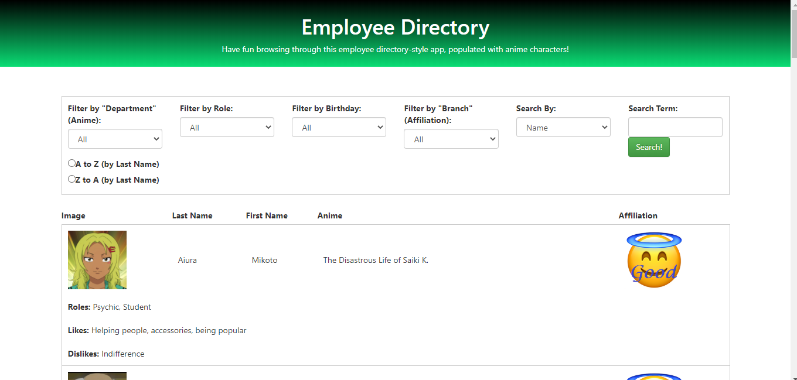

# Employee Directory
  

This project contains code for a directory system that could be used to sort through employees. I have added a fun little twist: the data is populated with characters from some anime that I enjoy. However, the functionality could easily be used for a more straightforward employee directory, or really any sort of directory of users. A link to the deployed version can be found [here.](https://salty-sierra-88203.herokuapp.com/)

[Introduction](#introduction)  
[Installation](#installation)  
[Usage](#usage)  
[Contributing](#contributing)  
[License](#license)  
[About the Author](#about-the-author)  

## Introduction

  

Users can filter, sort and search through a list of anime characters according to various filters as well as their own specified search term. Filters include:  
- what anime the character is from  
- what their role is  
- their affiliation (good, evil, neutral) 
- what month they were born in.  

Users can sort alphabetically or reverse-alphabetically by last name, and can enter a search term and select a property to query for that search term (for instance, name). The app is built using react, and hosted on heroku via an express.js server. It is constructed using several components (Header, Searchbar, Table and TableRow) each with their own stylesheet, as well as Bootstrap. The app uses context to provide a global state which includes the list of characters currently being displayed, as well as a function to update the filters and sort method, which is called by the Searchbar. This method is simply a series of filter functions imposed on the array of all characters. If the filter in any given category is "All", the filter function for that category automatically returns true for every element. Otherwise, it checks to see if that property on each character includes the filter category. The final filter function is the searchTerm filter. First, it checks to see if the searchTerm is 0 characters long. If it is, all elements return true and are kept in the array. Otherwise, the searchCat (category) is checked. If it is 'name', both the firstName and lastName properties on the character object are checked to see if they include the searchTerm. Otherwise, the searchCat is plugged in as a object property and that property is checked to see if its value contains the searchTerm. Finally, the remaining items are sorted using a sort() method containing a comparison function. This function takes two parameters, a and b referring to each item in the array that will be compared. a.lastName and b.lastName are compared. If the order supplied is 'AtoZ', if a.lastName is less than b.lastName, it will be moved earlier in the array and vice versa. If the order is 'ZtoA' the opposite is done. Because all of the filters are chained, the user can impose as many filters as they choose.

## Installation

No installation needed! Simply navigate to the [heroku-hosted webpage](https://salty-sierra-88203.herokuapp.com/)!

### Dependencies

React, path, express.js. The app was built using create-react-app.

## Usage

To use the application, navigate to the deployed page and experiment with applying different filters and search terms.

## Contributing

If you notice any errors in the code, please submit a github issue. 

## License
### The project is licensed with an MIT License.

## About the Author

Joe Dvorak

Github: dvorakjt

Github repository: [github.com/dvorakjt](https://github.com/dvorakjt/)

Portfolio: [dvorakjt.github.io/](https://dvorakjt.github.io/)

Email: dvorakjt@gmail.co,

README generated by GeneREADME. Original template written with [StackEdit](https://stackedit.io/). Badges provided through shields.io.
